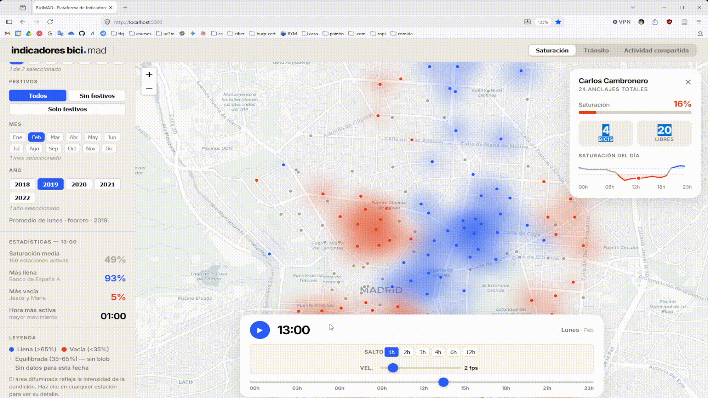
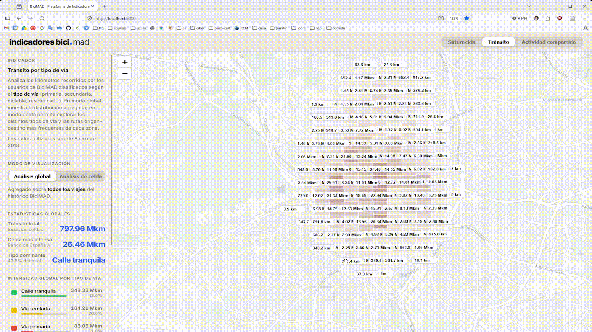
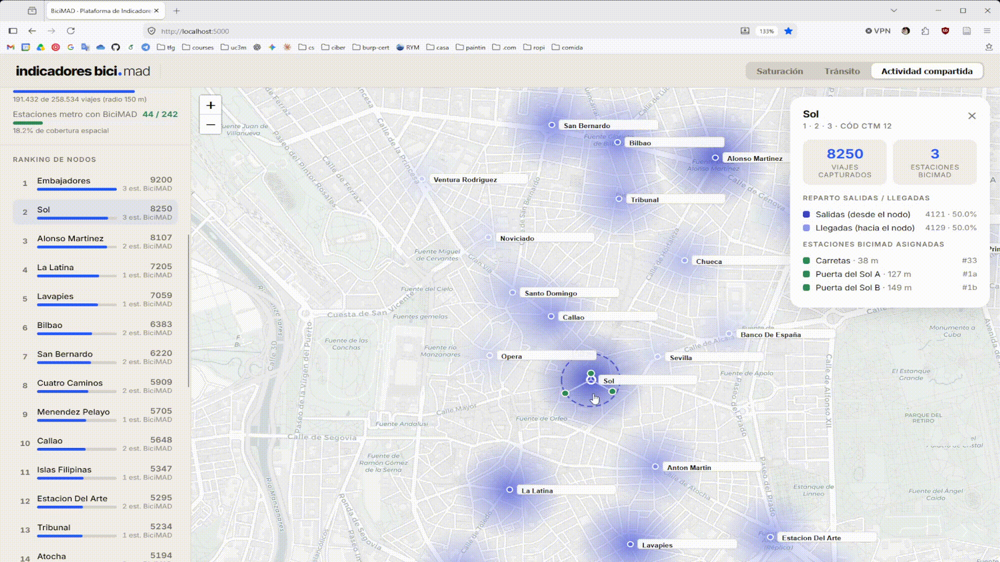

# Development of Bicimad OpenData indicators
For my final year project I have developed a pipeline to collect data from BiciMad OpenData portal. This process involves the analysis, cleaninng, processing and finally the visualization of the results. In the following repo you can find mainly the tools that I built for this last stage of the project, allongside some other material used for other purposes. The result of the visualization is the following. 
## Visualization of Bicimad stations saturation 

## Visualization of Bicimad transit regarding the kind of road

## Visualization of Bicimad shared activity with Metro Madrid

# Development of BiciMad OpenData indicators

For my final year project I developed a pipeline to collect data from the BiciMad OpenData portal. The process covers the analysis, cleaning, processing and, finally, the visualization of the results. In this repo you can find mainly the tools I built for this last stage of the project, alongside some other material used for other purposes.

The prototype is a single-page web application built with React and Leaflet, which consumes a custom Flask API connected to a PostgreSQL/PostGIS database. A public demo with artificial data is available at https://habie2.github.io/uc3m-tfg/.

The interface is organized in three tabs, one per indicator, sharing a common layout: a central map, a side panel with controls and an on-demand detail panel.

## Visualization of BiciMad stations saturation

Each station is displayed as a point colored on a gradient from blue (empty) to red (full). A slider at the bottom lets you go through the 24 hours of the day and see how saturation shifts between residential and office areas during rush hours.

The side panel allows you to:
- Filter by day of the week, month, year and public holiday.
- Switch between an **aggregated view** (average of all filtered days) and a **disaggregated view** (a specific range of days).

A statistics block always shows the average saturation, the fullest station and the emptiest station.

## Visualization of BiciMad transit regarding the kind of road

This indicator has two reading modes:

- **Global mode:** a heat map over a 500×500 m grid colors each cell by its cycling traffic intensity. The side panel shows a breakdown of total intensity by road type for the whole of Madrid.
- **Cell analysis mode:** selecting a cell overlays the road segments colored by type, along with the cycling routes that cross it. Routes are drawn with a width and opacity proportional to the number of trips. A percentage breakdown of usage by road type, specific to that cell, is also displayed.

## Visualization of BiciMad shared activity with Metro Madrid

Each Metro station is shown as a circle whose size and color reflect the volume of cycling traffic associated with it, making it easy to spot the most active bike–Metro interchanges.

Selecting a Metro station displays, connected by lines, the BiciMad stations assigned to it within the chosen radius, plus a floating panel with the total number of trips and the split between departures and arrivals.

The side panel allows you to:
- Adjust the influence radius (150, 300 or 500 m).
- Choose the metric to display (departures, arrivals or total).
- Check a donut chart with the selected station's coverage over the total number of trips.
- See a ranking of the most active stations and a summary of global statistics.